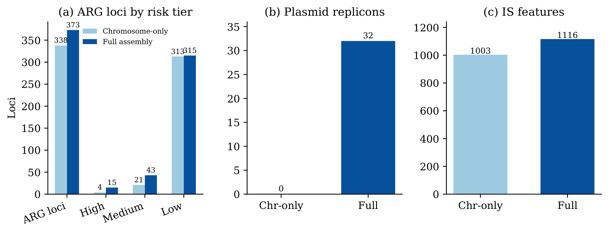
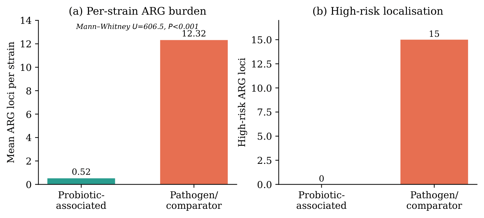
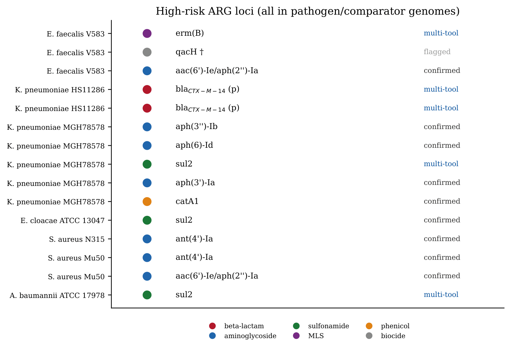
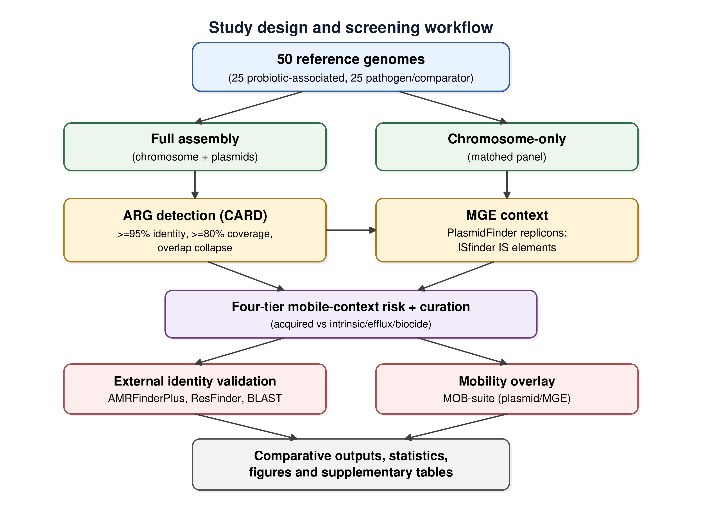
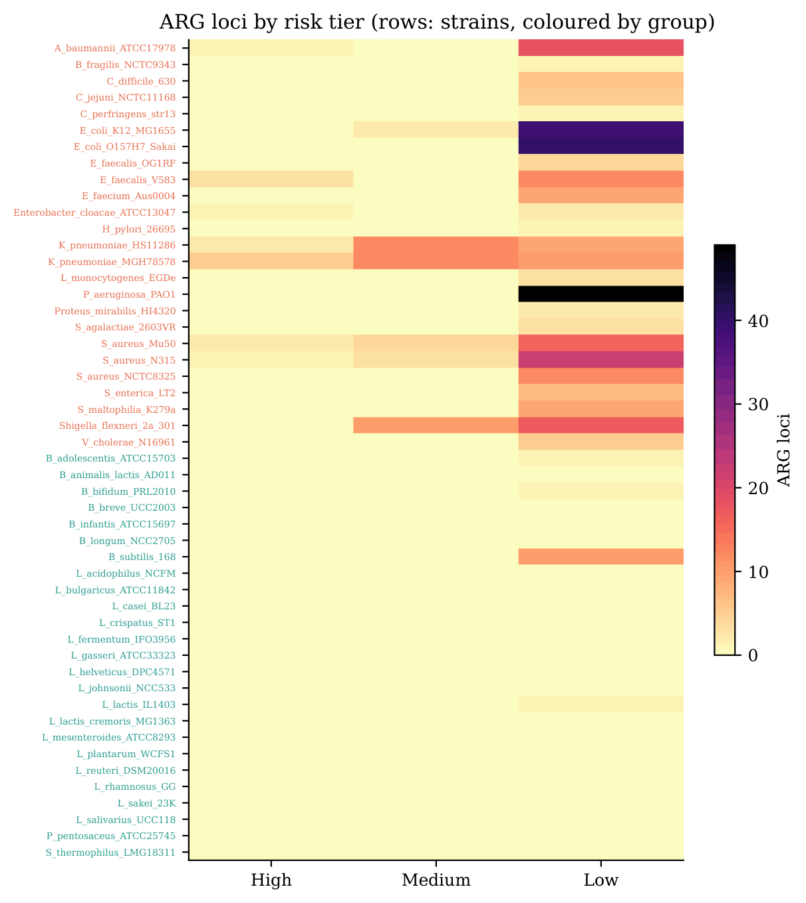
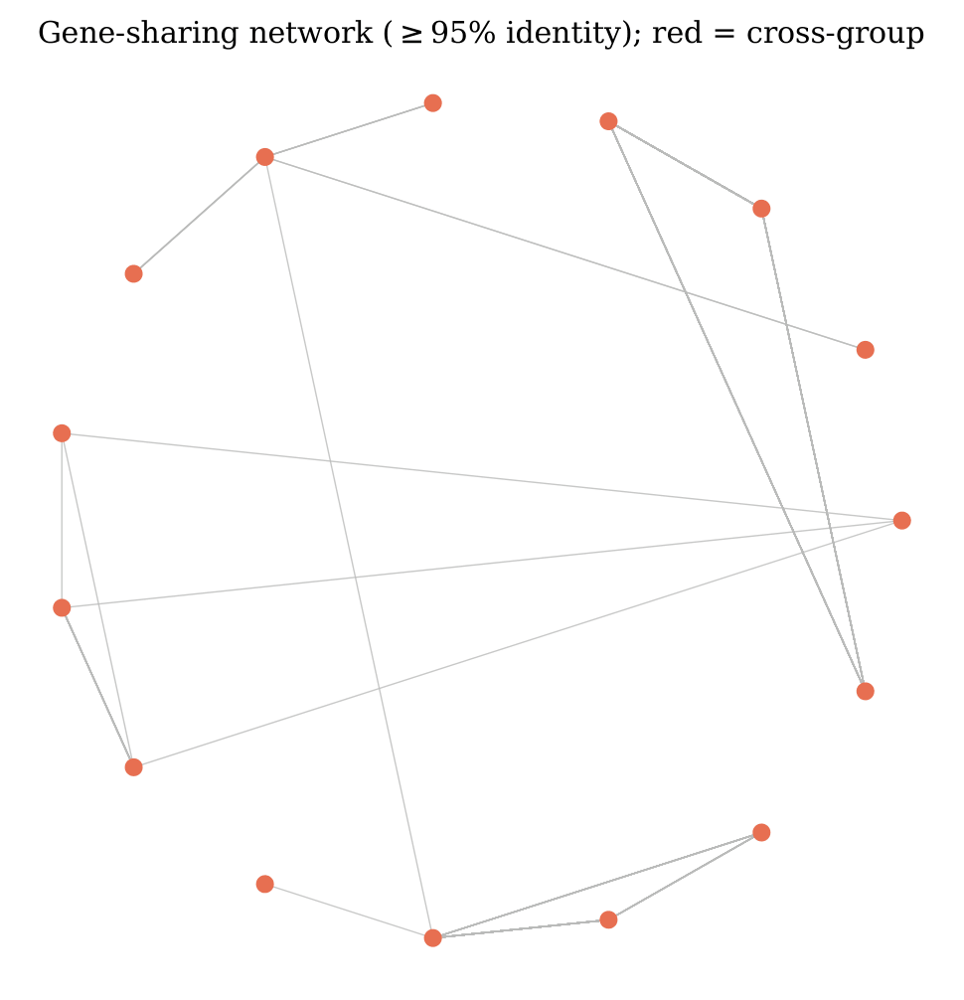
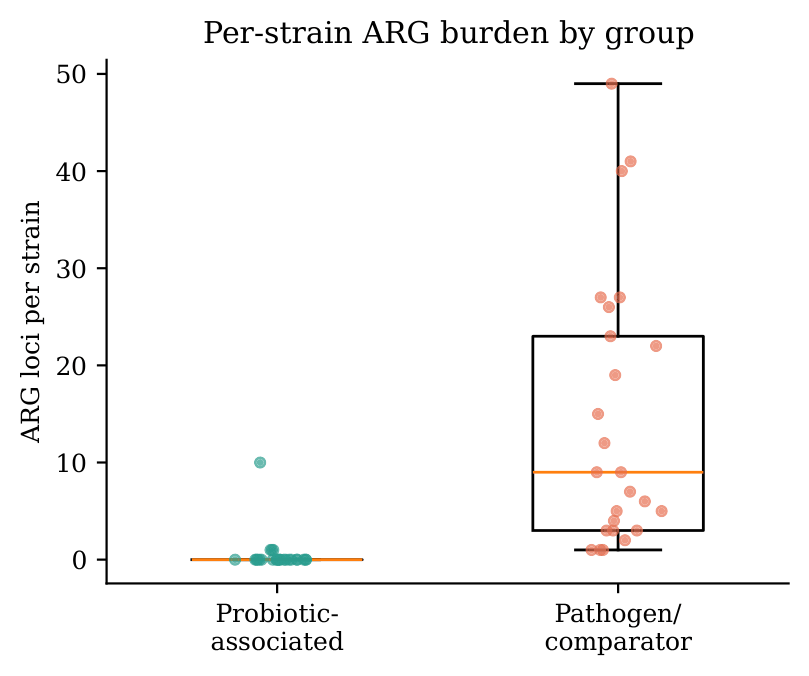
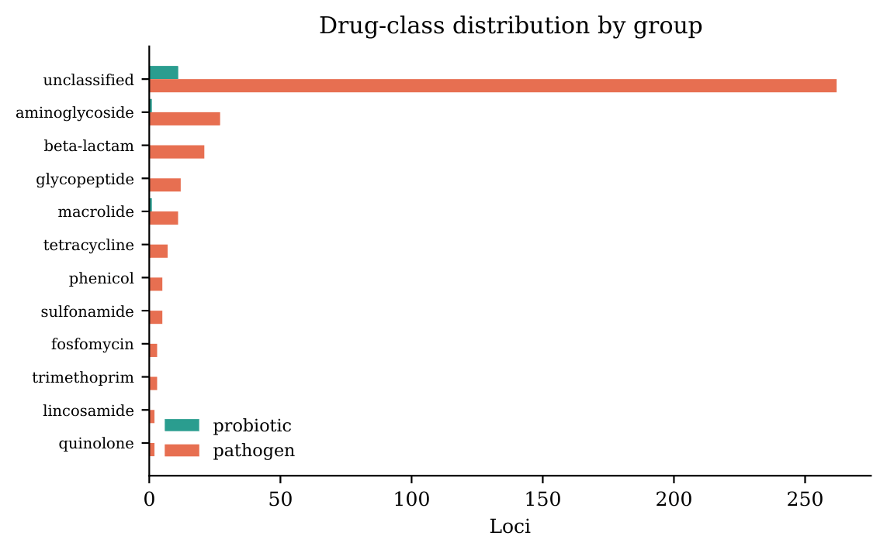

# 1DProb — Mobile Antibiotic-Resistance Cargo Screening

[](https://www.python.org/)
[](LICENSE)
[]()
[](https://www.biorxiv.org/content/10.64898/2026.06.11.731541v1)

> **Chromosome-only genome screening undercounts mobile antibiotic-resistance cargo:**
> a matched full-assembly comparison of probiotic-associated and pathogen reference genomes.

A reproducible, lightweight workflow that screens bacterial reference genomes for
antibiotic-resistance genes (ARGs) and their **mobile-genetic-element context**
(plasmid replicons + insertion sequences), assigns a four-tier mobile-context risk
category, and cross-validates calls with **AMRFinderPlus, ResFinder, BLAST and
MOB-suite**. The central result is methodological: *how much of the mobile
resistance cargo you see depends on whether you feed the screener the full
assembly or only the chromosome.*

---

## TL;DR — the headline result

On an identical panel of **50 reference genomes** (25 probiotic-associated, 25
pathogen/comparator), screening the **full assembly** instead of the
**chromosome only** changed the picture dramatically:

<p align="center">
  
</p>

| Metric | Chromosome-only | Full assembly | Δ |
|---|---:|---:|---:|
| ARG loci | 338 | 373 | **+35** |
| ‣ High-risk | 4 | **15** | **+11** |
| ‣ Medium-risk | 21 | 43 | +22 |
| ‣ Low-risk | 313 | 315 | +2 |
| Plasmid replicons | 0 | **32** | **+32** |
| Insertion-sequence features | 1003 | 1116 | +113 |

Chromosome-only screening recovered **fewer than a third** of the high-risk,
mobile-context loci — because plasmid-borne and IS-flanked cargo lives outside the
chromosome.

---

## Key findings

**High-risk mobile cargo is concentrated in pathogens, not probiotics.**
All 15 High-risk loci occurred in pathogen/comparator genomes; **none** in
probiotic-associated genomes. Per-strain ARG burden differed sharply
(mean 0.52 vs 12.32 loci; Mann–Whitney *U* = 606.5, *P* < 0.001), and **no ARG was
shared across groups** at ≥95% nucleotide identity (0 of 175 gene-sharing edges).

<p align="center">
  
</p>

**Every priority call carries an explicit validation status.** Identities were
cross-checked against three independent tools; confirmed, multi-tool-confirmed,
discordant and unconfirmed calls are reported separately rather than as a single
"validated" number.

<p align="center">
  
</p>

| Validation category | Loci |
|---|---:|
| Confirmed by AMRFinderPlus | 94 |
| Confirmed by ResFinder | 68 |
| Confirmed by BLAST | 46 |
| Confirmed by ≥2 tools (multi-tool) | 68 |
| Discordant (flagged for review) | 33 |
| Not externally checked / best database match | 224 |

---

## Workflow

<p align="center">
  
</p>

1. **Retrieve** genomes from NCBI RefSeq (full assembly *and* matched chromosome-only).
2. **Detect ARGs** against the CARD nucleotide catalogue (≥95% identity, ≥80% coverage; overlapping allele models collapsed).
3. **Detect MGE context** — PlasmidFinder replicons and ISfinder insertion sequences.
4. **Classify** each ARG into a four-tier mobile-context risk category.
5. **Curate** acquired cargo apart from intrinsic / efflux / biocide determinants.
6. **Validate** identities (AMRFinderPlus, ResFinder, BLAST) and mobility (MOB-suite).

---

## Repository structure

```
1dprob/
├── README.md
├── LICENSE
├── requirements.txt
├── .gitignore
├── config/                      # YAML run configurations
├── src/                         # core screening pipeline (package)
├── scripts/                     # SOTA-v2 analysis & validation scripts
├── tests/                       # unit / smoke tests
├── gen_figs.py                  # build aggregate figures (Fig 1–4, S1–S3)
├── make_figures.py              # build data-dependent figures (S4–S7) from results
├── run_smoke.py                 # quick end-to-end smoke test
├── scale50_genomes.tsv          # genome accession list (Supplementary Table S1 source)
├── results/
│   ├── results_scale50/         # full-assembly run  (canonical)
│   ├── results_scale50_chronly/ # chromosome-only matched run (canonical)
│   └── results_sota/            # external-validation outputs (canonical)
├── figs/                        # generated figures (PDF + PNG)
└── manuscript/                  # LaTeX manuscript package
```

> Only the **three canonical result sets** above are tracked. The dozens of
> intermediate snapshots from development (`results_CARD_*`, `results_PHASE4_*`,
> `results_SCALE20*`, `results_FINAL_*`, `*_COMPLETE`, `*_BACKUP`, …) are **not**
> committed — they are archived for provenance on Zenodo (see *Data availability*).

---

## Installation

No admin rights, WSL or conda required (developed on Windows with the `py` launcher).

```bash
git clone https://github.com/abdullahak07/1dprob.git
cd 1dprob
py -m pip install -r requirements.txt
```

---

## Reproducing the analysis

```bash
# 1) Full end-to-end screen (full assembly)
py -m src.pipeline --config config/config_scale50.yaml --out results_scale50

# 2) Matched chromosome-only screen
py -m src.pipeline --config config/config_scale50_chronly.yaml --out results_scale50_chronly

# 3) External validation (AMRFinderPlus / ResFinder / BLAST / MOB-suite)
py scripts/validate_arg_calls.py --results results_scale50 --out results_sota

# 4) Figures
py gen_figs.py                                                   # Fig 1–4, S1–S3
py make_figures.py --results results_scale50 --sota results_sota --out figs   # S4–S7
```

> Adjust the config filenames to match those in `config/`. A fast sanity check is
> `py run_smoke.py`.

---

## Figure gallery

| Strain × risk heatmap (S4) | Gene-sharing network (S5) |
|:---:|:---:|
|  |  |
| **Per-strain burden (S6)** | **Drug-class by group (S7)** |
|  |  |

---

## Data availability

- **Genomes.** No new sequencing data were generated. All 50 genomes are public
  NCBI RefSeq reference assemblies; accessions are in `scale50_genomes.tsv`
  (Supplementary Table S1). Raw FASTA is **not** committed — re-download from the
  accession list.
- **Processed results.** The canonical result tables under `results/` reproduce
  every figure and table in the manuscript.
- **Full provenance archive.** The complete working tree, including all development
  snapshots, is archived at Zenodo: **[DOI to be inserted]**.

---

## Manuscript

The accompanying manuscript (target journal: *Microbial Genomics*) is in
`manuscript/`. Build with:

```bash
cd manuscript
pdflatex SCALE50_manuscript.tex   # run 2–3× to resolve references
```

---

## Citation

If you use this code or data, please cite:

> Saniya, Khan A.A. *Chromosome-only genome screening undercounts mobile
> antibiotic-resistance cargo: a matched full-assembly comparison of
> probiotic-associated and pathogen reference genomes.* (in preparation).

Tools this work depends on — please cite them too: CARD (Alcock et al. 2023),
AMRFinderPlus (Feldgarden et al. 2021), ResFinder (Bortolaia et al. 2020),
MOB-suite (Robertson & Nash 2018), PlasmidFinder (Carattoli et al. 2014),
ISfinder (Siguier et al. 2006), BLAST+ (Camacho et al. 2009).

---

## License

Released under the [MIT License](LICENSE).

## Acknowledgements

This study used publicly available reference genomes from NCBI RefSeq and the
CARD, PlasmidFinder and ISfinder resources, and the AMRFinderPlus, ResFinder and
MOB-suite tools. We thank their developers and curators.
